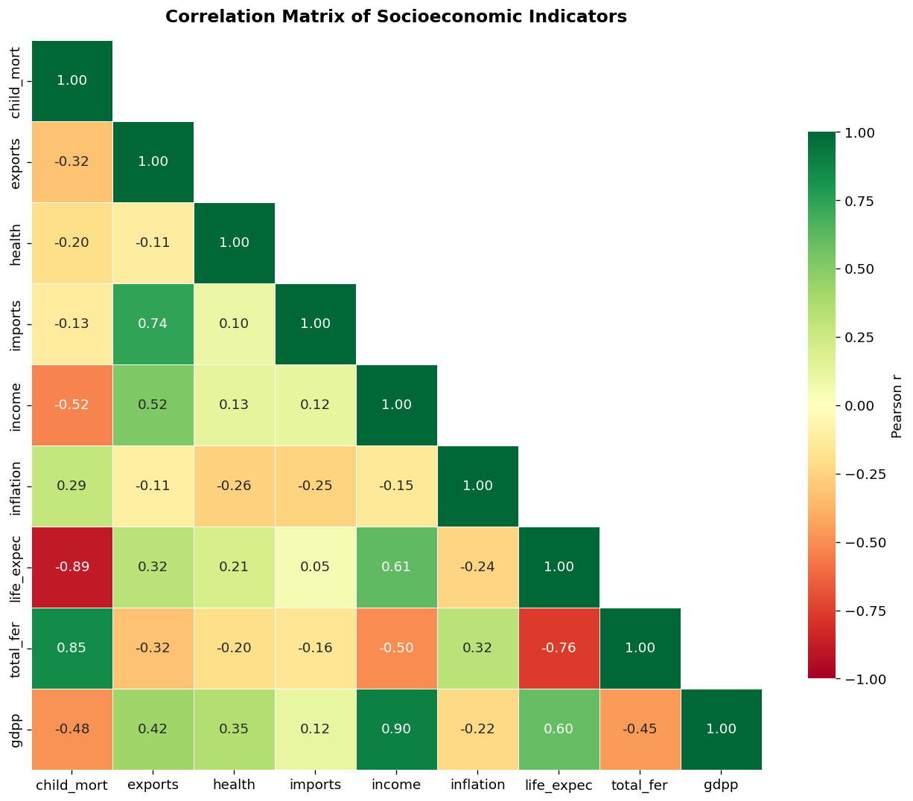
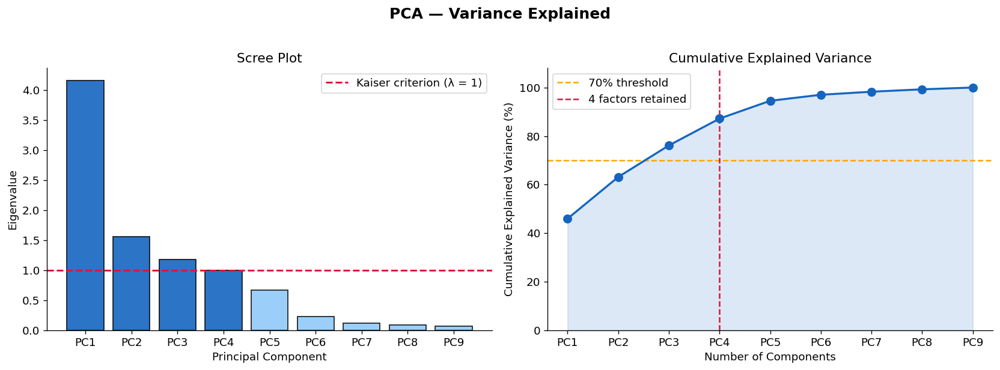
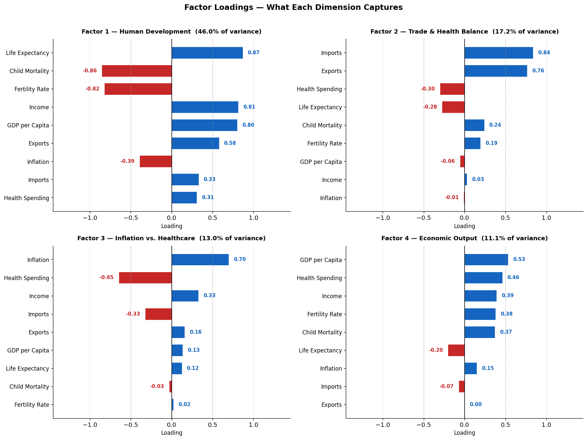
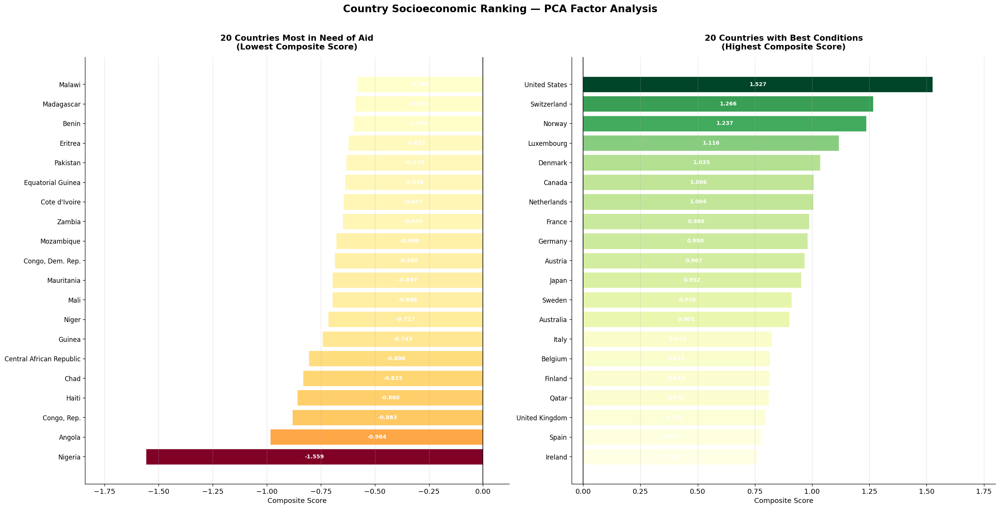
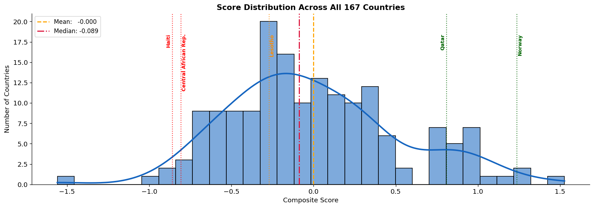

# Country Socioeconomic Ranking — PCA & Factor Analysis

## The Challenge

An NGO's CEO needs to allocate limited humanitarian funds to the countries most in need. With 167 countries and 9 socioeconomic indicators, no single metric tells the full story. Child mortality alone might overlook economic collapse; GDP alone misses healthcare crises.

**The question: how do you combine nine dimensions into a single, defensible priority list?**

This project answers that using **Principal Component Analysis (PCA) and Factor Analysis**, a technique that finds the hidden structure in complex, correlated data and reduces it to a small set of interpretable dimensions.

---

## Dataset

> **Publicly available on Kaggle** — [Unsupervised Learning on Country Data](https://www.kaggle.com/datasets/rohan0301/unsupervised-learning-on-country-data), originally compiled by **HELP International**, an international humanitarian NGO.

Download the dataset and place `Country-data.csv` inside the `data/` folder before running the script:

```bash
# Option 1 — Kaggle API
pip install kaggle
kaggle datasets download -d rohan0301/unsupervised-learning-on-country-data
unzip unsupervised-learning-on-country-data.zip -d data/

# Option 2 — Manual
# Visit the link above, click Download, and move Country-data.csv to data/
```

| Variable | Description |
|---|---|
| `child_mort` | Deaths of children under 5 years per 1,000 live births |
| `exports` | Exports as % of GDP per capita |
| `health` | Total health spending as % of GDP per capita |
| `imports` | Imports as % of GDP per capita |
| `income` | Net income per person |
| `inflation` | Annual GDP growth rate |
| `life_expec` | Average life expectancy at birth |
| `total_fer` | Fertility rate (children per woman) |
| `gdpp` | GDP per capita |

---

## Step 1 — The Variables Are Deeply Correlated



The heatmap reveals strong interdependencies across all 9 indicators. Countries with high GDP per capita tend to have long life expectancy (r = 0.80) and low child mortality (r = −0.83). High fertility rates strongly predict high child mortality (r = 0.85). Health spending correlates with life expectancy (r = 0.61).

This web of correlations is exactly what makes PCA valuable, instead of juggling 9 redundant numbers, we can distill them into a few independent, interpretable dimensions.

**Bartlett's Sphericity Test** confirms statistically (p ≈ 0) that these correlations are real, not random noise, validating the use of PCA.

---

## Step 2 — How Many Dimensions Are Enough?



PCA found that **4 underlying factors** capture **87.7% of all variation** across 167 countries. The **Kaiser criterion** (retain factors with eigenvalue > 1) guided this selection.

The sharp elbow after PC1 in the scree plot is the first major finding: **one single dimension accounts for nearly half the story**. Everything else is a refinement.

---

## Step 3 — What Each Dimension Means



### Factor 1 — Human Development (46% of the story)

This is the master factor. It captures the classic **demographic transition** — the divide between nations that have escaped the poverty trap and those still caught in it.

- **What drives it up:** Life expectancy (+0.87), income (+0.81), GDP per capita (+0.80), exports (+0.58)
- **What drives it down:** Child mortality (−0.86), fertility rate (−0.82)

A country's position on Factor 1 alone predicts most of what we need to know. Rich, healthy, long-lived nations score high; poor, high-mortality, high-fertility nations score low.

### Factor 2 — Trade & Health Balance (17%)

This factor separates countries by trade intensity (imports at +0.84, exports at +0.76) against healthcare investment. After sign correction, it rewards countries with better health outcomes and lower dependence on trade as a share of their economy, flagging nations where resource exports mask poor domestic welfare, such as oil-rich states with high exports but inadequate health systems.

### Factor 3 — Inflation vs. Healthcare Investment (13%)

A tension factor. Inflation (+0.70) and health spending (−0.65) pull in opposite directions, countries with economic instability tend to underinvest in healthcare, or vice versa. After sign correction, **price stability and healthcare investment** score positively.

### Factor 4 — Economic Output (11%)

Captures residual economic variance: GDP per capita (+0.53), health spending (+0.46), income (+0.39). Particularly useful for distinguishing resource-rich states — Gulf countries with extreme oil wealth that don't fit cleanly into the other three factors.

---

## Step 4 — The Final Ranking

Each country receives a **composite score**: a weighted sum of its scores on all 4 factors, where each factor's weight equals its share of explained variance. Higher score = better conditions. Lower score = greater need for humanitarian aid.



### Who Needs Help Most: A Concentrated Crisis in Sub-Saharan Africa

**Nigeria** sits at the very bottom (Rank 167, Score: −1.56). Despite being Africa's largest oil exporter, its child mortality rate of 130 per 1,000 live births and life expectancy of 60 years reveal a textbook **resource curse**, wealth extracted but not distributed. 15 of the 20 most vulnerable countries are in Sub-Saharan Africa.

**Haiti** (Rank 164, Score: −0.86) is the only non-African entry in the bottom 20, the Western Hemisphere's most acute humanitarian case, with child mortality of 208 per 1,000 and life expectancy of just 32 years.

What unites these countries is not just poverty, but a compound crisis: very high child mortality, short life expectancy, and healthcare systems unable to meet demand.

### Who Ranks Highest: Wealth, Stability, and Investment Working Together

**Qatar** leads (Score: 1.68), driven by extraordinary per capita income ($125,000) and long life expectancy (79.5 years). Its top rank despite relatively low health spending (1.81% of GDP) shows how dominant Factor 1, is economic output and survival outcomes outweigh the healthcare investment dimension.

**Norway**, **Luxembourg**, and **Switzerland** follow nations, combining high incomes with genuine investment in health and long lives.

---

## Key Insight: Wealth Alone Does Not Tell the Full Story



The score distribution is right-skewed: most countries cluster near zero, but the bottom tail extends sharply, confirming that the worst-off nations are not just "a little below average" but in a qualitatively different category of suffering.

**Lesotho** (Rank 165, Score: −0.88) illustrates why a multidimensional approach matters. With GDP per capita of $1,170 it is far from the poorest country in the dataset, yet it ranks near the very bottom. Life expectancy of just 46.5 years and child mortality of 99.7 per 1,000 signal a healthcare crisis that GDP alone would mask.

Similarly, **Equatorial Guinea** (Rank 153) has one of Africa's highest GDPs per capita ($17,100) from oil, yet ranks among the bottom 20, because that wealth has not translated into long lives or low child mortality. The model correctly identifies that extractive wealth without human development does not constitute "doing well."

---

## Methodology

| Step | Method |
|---|---|
| Data standardization | Z-score normalization (mean = 0, std = 1) |
| PCA validity check | Bartlett's Sphericity Test |
| Dimensionality reduction | PCA with Kaiser criterion |
| Factor sign orientation | Dynamic alignment via beneficial variables net loading |
| Composite score | Weighted sum by explained variance per factor |

---

## Run It

```bash
# 1. Clone the repo
git clone https://github.com/leo-bonacini/Country_Aid_Ranking.git
cd Country_Aid_Ranking

# 2. Install dependencies
pip install -r requirements.txt

# 3. Download the dataset from Kaggle and place Country-data.csv in data/
#    https://www.kaggle.com/datasets/rohan0301/unsupervised-learning-on-country-data

# 4. Run the analysis
python country_ranking_analysis.py
```

## Tech Stack

Python · scikit-learn · pandas · numpy · matplotlib · seaborn · scipy

## Project Structure

```
country-aid-ranking/
├── data/
│   ├── Country-data.csv       # download from Kaggle (not tracked in git)
│   └── *.png                  # charts generated on run
├── country_ranking_analysis.py
├── requirements.txt
└── README.md
```
